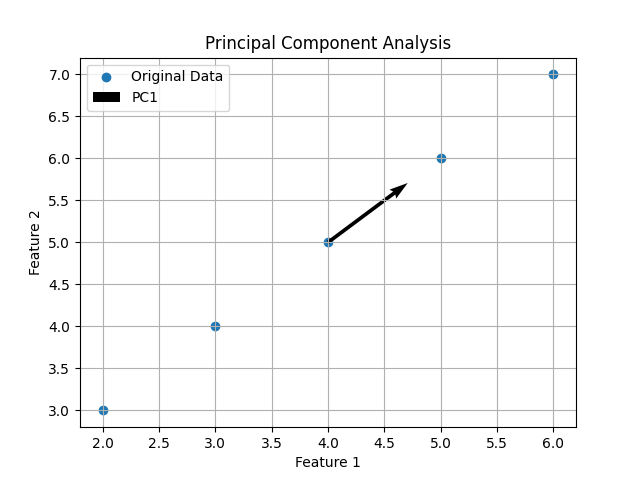
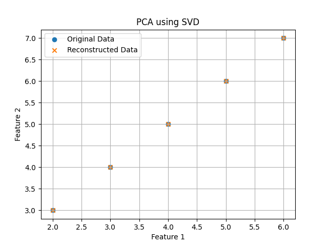

# Principal Component Analysis (PCA)

  

## Introduction

Principal Component Analysis (PCA) is an **unsupervised machine learning technique** used for **dimensionality reduction**.  
It transforms a dataset with many correlated variables into a smaller set of **uncorrelated variables called principal components**.

The goal of PCA is to retain the **maximum variance** in the data while reducing the number of features.

The first principal component captures the **maximum variance**, the second captures the **second highest variance**, and so on, while remaining orthogonal to each other.

---

# Algorithm: PrincipalComponentAnalysis

## Input:
    X = Dataset with n samples and m features

## Output:
    Z = Transformed dataset with reduced dimensions

---

## Steps:

1. Standardize the dataset

       X_centered ← X − mean(X)

2. Compute covariance matrix

       C ← (1 / (n − 1)) × X_centeredᵀ X_centered

3. Compute eigenvalues and eigenvectors of covariance matrix

       C v = λ v

4. Sort eigenvalues in descending order

5. Select top k eigenvectors

6. Form projection matrix

       W ← [v1 v2 ... vk]

7. Transform the data

       Z ← X_centered × W

8. Return reduced dataset Z

---

## Mathematical Objective

PCA maximizes the variance of projected data.

Variance of projection:

       Var(Z) = Wᵀ C W

Subject to:

       WᵀW = I

---

## Time Complexity

Training: O(nm² + m³)  
Projection: O(nmk)

Where:
- n = number of samples  
- m = number of features  
- k = number of principal components

---

## Space Complexity

O(nm)

---

## Conclusion

PCA is widely used for **dimensionality reduction, noise removal, and data visualization**.  
It helps improve machine learning performance by reducing redundant information.

---

# PCA using SVD

  

## Introduction

Singular Value Decomposition (SVD) is another method to compute Principal Component Analysis efficiently.  
Instead of calculating the covariance matrix, PCA can be performed directly using **matrix factorization**.

SVD decomposes the data matrix into three matrices:

       X = U Σ Vᵀ

Where:

- U = Left singular vectors  
- Σ = Singular values  
- V = Right singular vectors (principal components)

The columns of **V** represent the **principal directions** of the data.

---

# Algorithm: PCA_Using_SVD

## Input:
    X = Dataset with n samples and m features  
    k = number of principal components

## Output:
    Z = Reduced dimensional dataset

---

## Steps:

1. Compute mean of dataset

       μ ← mean(X)

2. Center the dataset

       X_centered ← X − μ

3. Perform Singular Value Decomposition

       X_centered = U Σ Vᵀ

4. Select first k columns of V

       V_k ← first k columns of V

5. Project the dataset

       Z ← X_centered × V_k

6. Return reduced dataset Z

---

## Mathematical Objective

SVD factorizes the data matrix:

       X = U Σ Vᵀ

Principal components are given by:

       PC = V

Projected data:

       Z = X V_k

---

## Time Complexity

SVD computation: O(min(nm², n²m))

Projection: O(nmk)

---

## Space Complexity

O(nm)

---

## Conclusion

PCA using SVD is **numerically stable and efficient**, especially for large datasets.  
It is widely used in machine learning, signal processing, and computer vision for dimensionality reduction.