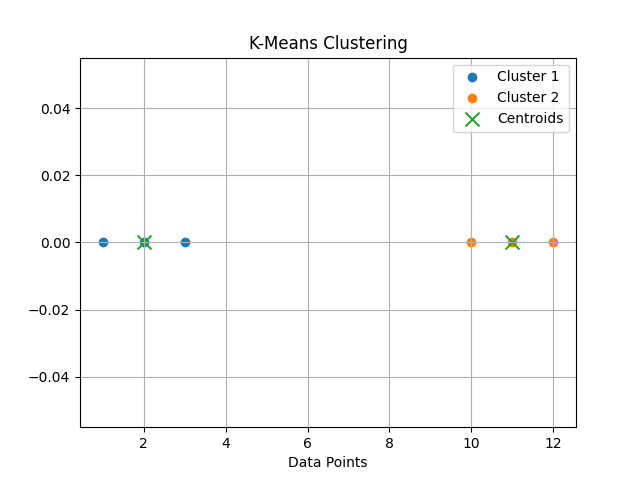

# K-Means Clustering

  

## Introduction

K-Means is an **unsupervised machine learning algorithm** used for **clustering data into K groups**.  
It partitions data points into clusters such that points in the same cluster are **more similar to each other than to points in other clusters**.

The algorithm works by iteratively assigning points to the nearest **centroid** and then recalculating the centroid of each cluster.

---

# Algorithm: K-Means Clustering

## Input
    X = Dataset containing n data points
    K = Number of clusters

## Output
    K clusters with their centroids

---

## Steps

1. Choose the number of clusters.

       K ← number of clusters

2. Initialize K centroids randomly.

3. Assign each data point to the nearest centroid.

       cluster_i ← argmin distance(x, centroid_j)

4. Update centroids.

       centroid_j ← mean(points in cluster j)

5. Repeat steps 3 and 4 until centroids do not change.

6. Return final clusters and centroids.

---

## Mathematical Objective

K-Means minimizes the **Within-Cluster Sum of Squares (WCSS)**:

       J = Σ Σ ||xi − μj||²

Where:
- xi = data point
- μj = centroid of cluster j

---

## Time Complexity

Average Case:

    O(n × k × i × d)

Where  
n = number of data points  
k = number of clusters  
i = number of iterations  
d = number of features  

---

## Space Complexity

    O(n)

---

## Implementation

Python implementation is available in:

    K-Mean.py

---

## Conclusion

K-Means is a simple and efficient clustering algorithm widely used in **data mining, pattern recognition, customer segmentation, and image compression**.