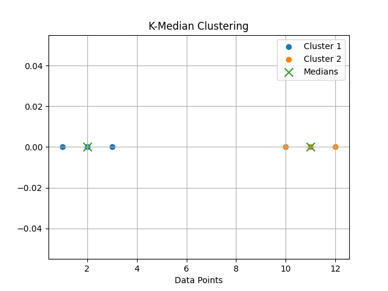

# K-Median Clustering

  

## Introduction

K-Median is an **unsupervised clustering algorithm** similar to K-Means, but instead of using the **mean**, it uses the **median** to determine the cluster center.

This makes K-Median more **robust to outliers**, since the median is less affected by extreme values compared to the mean.

K-Median typically uses **Manhattan distance (L1 distance)** to measure similarity between data points and cluster centers.

---

# Algorithm: K-Median Clustering

## Input
    X = Dataset containing n data points  
    K = Number of clusters

## Output
    K clusters with their corresponding medians

---

## Steps

1. Choose the number of clusters.

       K ← number of clusters

2. Initialize K cluster centers randomly.

3. Assign each data point to the nearest cluster center using Manhattan distance.

       cluster_i ← argmin |x − median_j|

4. Update the cluster centers.

       median_j ← median(points in cluster j)

5. Repeat steps 3 and 4 until cluster centers stop changing.

6. Return final clusters and medians.

---

## Mathematical Objective

K-Median minimizes the **sum of absolute distances** between data points and their cluster centers:

       J = Σ Σ |xi − mj|

Where:
- xi = data point
- mj = median of cluster j

---

## Time Complexity

Average Case:

    O(n × k × i × d)

Where  
n = number of data points  
k = number of clusters  
i = number of iterations  
d = number of features  

---

## Space Complexity

    O(n)

---

## Implementation

Python implementation is available in:

    K-Median.py

---

## Conclusion

K-Median clustering is useful when datasets contain **outliers or skewed distributions**.  
Because it uses the median instead of the mean, it produces **more robust cluster centers** compared to K-Means in such cases.