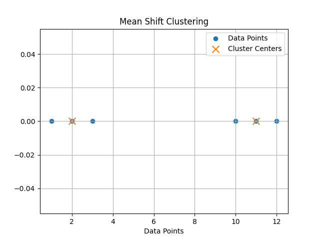

# Mean Shift Clustering

  

## Introduction

Mean Shift is an **unsupervised clustering algorithm** used to identify clusters in a dataset without specifying the number of clusters beforehand.

Unlike algorithms such as K-Means, Mean Shift **does not require the number of clusters (K) to be defined in advance**. Instead, it automatically finds clusters by locating **dense regions of data points**.

The algorithm works by **iteratively shifting data points toward the average (mean) of points within a defined neighborhood**, known as the **bandwidth**.

---

# Algorithm: Mean Shift Clustering

## Input
    X = Dataset containing n data points  
    h = Bandwidth (window radius)

## Output
    Cluster centers and grouped data points

---

## Steps

1. Select a kernel bandwidth.

       h ← bandwidth parameter

2. Place a sliding window on a data point.

3. Compute the mean of all data points inside the window.

       mean ← average(points within bandwidth)

4. Shift the window center to the computed mean.

5. Repeat steps 3 and 4 until convergence (the mean no longer changes).

6. Points that converge to the same location belong to the same cluster.

7. Return the cluster centers and clusters.

---

## Mathematical Objective

Mean Shift updates the center using the mean of points within the bandwidth:

       m(x) = ( Σ xi ) / n

Where:
- xi = points inside the window
- n = number of points within the bandwidth

---

## Time Complexity

Typical Case:

    O(n²)

Where  
n = number of data points

---

## Space Complexity

    O(n)

---

## Implementation

Python implementation is available in:

    MeanShift.py

---

## Conclusion

Mean Shift is useful for **detecting clusters of arbitrary shapes and automatically determining the number of clusters**.  
It is commonly used in **image segmentation, object tracking, and computer vision applications**.