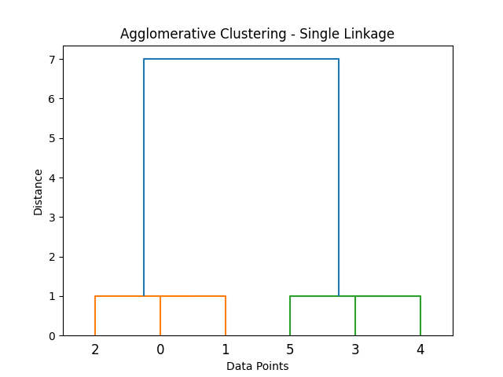
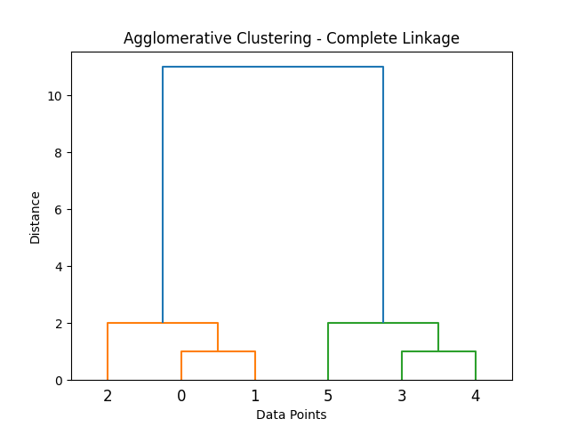
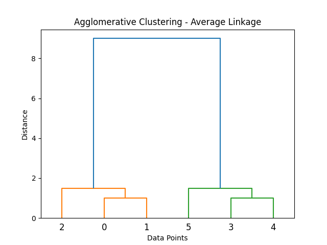
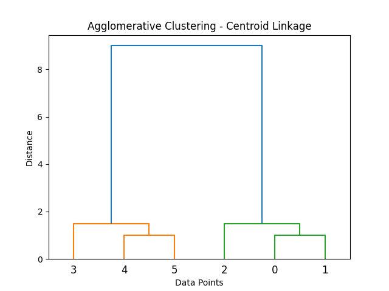
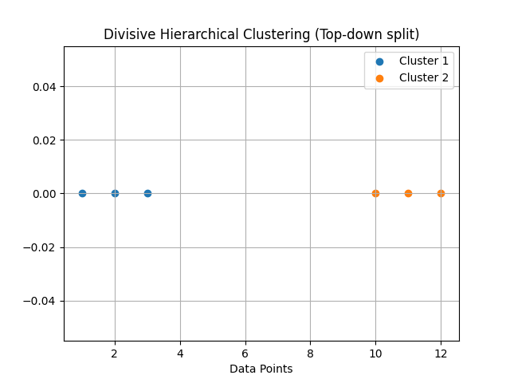

# Hierarchical Clustering

  

## Introduction

Hierarchical Clustering is an **unsupervised machine learning algorithm** used to group similar data points into clusters.  
Unlike partition-based algorithms like K-Means, hierarchical clustering creates a **tree-like structure called a dendrogram** that shows how clusters are formed.

There are two main approaches:

- **Agglomerative (Bottom-Up)**  
- **Divisive (Top-Down)**  

Agglomerative clustering starts with each data point as a separate cluster and merges them step by step.  
Divisive clustering starts with one cluster and repeatedly splits it into smaller clusters.

---

# Algorithm: Agglomerative Hierarchical Clustering

## Input
    X = Dataset containing n data points

## Output
    Dendrogram representing cluster hierarchy

---

## Steps

1. Start with each data point as its own cluster.

2. Compute distances between all clusters.

3. Merge the two closest clusters.

4. Update the distance matrix.

5. Repeat steps 3–4 until only one cluster remains.

6. Represent the clustering process using a **dendrogram**.

---

# Linkage Methods

Different linkage methods determine how the distance between clusters is calculated.

---

## 1. Single Linkage

  

Distance between two clusters is defined as the **minimum distance between any two points** in the clusters.

Formula:

    D(A,B) = min(distance(a,b))

Where  
a ∈ cluster A  
b ∈ cluster B

---

## 2. Complete Linkage

  

Distance between clusters is the **maximum distance between any two points**.

Formula:

    D(A,B) = max(distance(a,b))

---

## 3. Average Linkage

  

Distance between clusters is the **average distance between all pairs of points**.

Formula:

    D(A,B) = average(distance(a,b))

---

## 4. Centroid Linkage

  

Distance between clusters is calculated using the **distance between cluster centroids**.

Formula:

    D(A,B) = distance(centroid_A , centroid_B)

---

# Divisive Hierarchical Clustering

  

Divisive clustering follows a **top-down approach**.

## Steps

1. Start with all data points in a single cluster.

2. Split the cluster into two smaller clusters.

3. Continue splitting clusters recursively.

4. Stop when each data point becomes its own cluster or a stopping condition is reached.

---

## Time Complexity

Typical Complexity:

    O(n² log n)

Where  
n = number of data points

---

## Space Complexity

    O(n²)

---

## Implementation

Python implementation is available in:

    Hierarchical.py

---

## Conclusion

Hierarchical Clustering is useful for **exploring the structure of data** and visualizing cluster relationships using dendrograms.  
It is widely used in **bioinformatics, document clustering, and taxonomy analysis**.